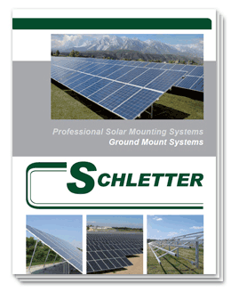
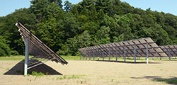
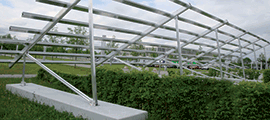

<ul class="related-links right">
Related:<li><a href="team.html">Team</a></li>
<li><a href="careers.html">Careers</a></li>
<!--<li><a href="FAQs.html">FAQs</a></li>-->
<li><a href="press.html">Press</a></li>
</ul>

<ul class="nav nav-tabs responsive hidden-xs hidden-sm" >
<li class="active">
<a href="#tabs-1" data-toggle="tab">Ground Mount</a>
</li>
<li class="">
<a href="#tabs-2" data-toggle="tab">Roof Mount </a></li>
<li class="">
<a href="#tabs-3" data-toggle="tab">Components / Tools</a></li>
<li class="">
<a href="#tabs-4" data-toggle="tab">Installation Manual</a>
</li>
<li class="">
<a href="#tabs-5" data-toggle="tab">Customer Success Stories</a>
</li>
<!--<li class=""><a href="#tabs-5" data-toggle="tab">Project checklists</a></li>-->
</ul>

<table class="col-md-8 left">
<tbody><tr>
<th>
<h4>Ground Mount Product Brochures</h4></th>
<th><h5></h5></th>
<th>
<h5></h5></th>
</tr>
<tr>
<td>
<strong style="color:#004628;">New! G-Max Ground Mount System</strong>: The next generation of racking providing quality, 
exceptional ease-of-assembly in the field, 
and competitive pricing—in a steel mounting system.
</td>
<td>
<a href="/support/MI-074%20G-Max%20Brochure.pdf" target="_blank">PDF</a>
</td>

</tr>
<tr>
<td>
<strong>FS System:</strong> Mid- to- utility-scale applications, ETL classified ground mount system
</td>
<td><a href="support/FS-System-Product-Sheet.pdf" target="_blank">PDF</a></td>
 <td></td>
</tr>            
<tr>
<td>
<strong>PvMax</strong>: Small to mid-sized applications or for difficult terrain
 </td>
<td><a href="support/PvMax-Product-Sheet.pdf" target="_blank">PDF</a></td>
<td><a href="support/EspanI400050PVMax3.pdf" target="_blank">PDF</a></td>
</tr>
<tr>
<td>
<strong>PvMini</strong>: A smaller ballasted solution for one vertical row or two horizontal rows
</td>
<td><a href="support/PvMini-Product-Sheet.pdf" target="_blank">PDF</a></td>
<td>&nbsp;</td>
</tr>
<tr>
<td>
<strong>Park@Sol</strong>: Modular carport system, designed to accommodate almost any area.
</td>
<td><a href="support/Park@Sol-Product-Sheet.pdf" target="_blank">PDF</a></td>
<td></td>
</tr>
<tr>
<td>
<strong>FS Uno</strong>: All-steel pile driven ground mount system
</td>
<td><a href="support/FS-Uno-Product-Sheet.pdf" target="_blank">PDF</a></td>
<td></td>
</tr>
<tr>
<td>
<strong>FS Duo</strong>: All-steel, two-post pile driven ground mount system
</td>
<td><a href="support/FS-Duo-Product-Sheet.pdf" target="_blank">PDF</a></td>
<td></td>
</tr>

</tbody></table>
<!--

-->

<table class="col-md-8 col-sm-8 left">
<tbody><tr>
<th><h4>Roof Mount Product Brochures</h4></th>
<th><h5></h5></th>
<th>
<h5></h5></th>
</tr>
<!--<tr>
<td>
<strong>Roof Mount System Overview</strong>: All the roof mount systems conveniently listed
</td>
<td><a href="support/Roof-Mount-System-Overview.pdf" target="_blank">PDF</a></td>
<td><a href="support/EspanI400110SistemasMontadosenTechos.pdf" target="_blank">PDF</a></td>
</tr>-->
 <tr>
<td>
<strong>CompactGrid</strong>: For East/West facing roofs
</td>
<td><a href="support/Compact-Grid-Product-Sheet.pdf" target="_blank">PDF</a></td>
 <td>&nbsp;</td>
</tr>
<tr>
<td>
<strong>CompactVario</strong>: System for metal roofs with large spans
</td>
<td><a href="support/Compact-Vario-Product-Sheet.pdf" target="_blank">PDF</a></td>
<td>&nbsp;</td>
</tr>
<tr>
<td>
<strong>Fix-EZ</strong>: Designed for flat roofs, less components for the simplest installation
</td>
<td><a href="support/Fix-EZ-Product-Sheet.pdf" target="_blank">PDF</a></td>
<td>&nbsp;</td>
</tr>
<tr>
<td>
<strong>FixGrid</strong>: Highly optimized ballasted flat roof system
</td>
<td><a href="support/FixGrid-Product-Sheet.pdf" target="_blank">PDF</a></td>
<td>&nbsp;</td>
</tr>

<!--<tr>
<td>
<strong>SingleFix-V</strong>: Versatile roof attachment for trapezoidal sheet metal roofs
</td>
<td><a href="support/SingleFix-V-Product-Sheet.pdf" target="_blank">PDF</a></td>
<td>&nbsp;</td>
</tr>-->

<tr>
<td>
<strong>FixZ-7</strong>: A system for adding 5 to 7 degrees of module tilt on low-sloped roofs
</td>
<td><a href="support/FixZ-7-Product-Sheet.pdf" target="_blank">PDF</a></td>
<td>&nbsp;</td>
</tr>

<tr>
<td>
<strong>FixZ-15</strong>: A system for adding 10 to 15 degrees of module tilt on low-sloped roofs
</td>
<td><a href="support/FixZ-15-Product-Sheet.pdf" target="_blank">PDF</a></td>
<td>&nbsp;</td>
</tr>
<tr>
<td>
<strong>Windsafe</strong>: May be used as ballasted system or penetrating
</td>
<td><a href="support/Windsafe-Product-Sheet.pdf" target="_blank">PDF</a></td>
<td><a href="support/Windsafe_ESP.pdf" target="_blank">PDF</a></td>
</tr>
</tbody></table>

 

<table class="col-md-8 col-sm-8 left">
<tbody><tr>
<th><h4>Attachments, Components, Clamps Product Brochures</h4></th>
<th><h5></h5></th>
<th>
<h5></h5></th>
</tr>
              <tr>
<td>
<strong>Components Overview</strong>:Various attachments and components offered, includes rails 
</td>
<td><a href="support/I400003 Components Brochure.pdf" target="_blank"> &nbsp; PDF</a></td>
<td><a href="support/EspanI400003VistaGenerald Componentes.pdf" target="_blank">&nbsp; PDF</a></td>
</tr>
<tr>
	<td>
<strong>Module Clamps:</strong> New Rapid5K™ grounding module clamp with cost-effective design
</td>
<td><a href="support/MI-067 Module Clamps 100416.pdf" target="_blank">&nbsp; PDF</a></td>
<td>&nbsp;</td>
</tr>
<tr>
	<td>
<strong>Gayk Ram</strong>
</td>
<td><a href="support/MI-004 GAYK Ram V2.pdf" target="_blank">&nbsp; PDF</a></td>
<td>&nbsp;</td>
</tr>
<tr>
<td>
 <strong>Torque Table</strong>
</td>
<td><a href="support/Torque-Table-Product-Sheet.pdf" target="_blank">&nbsp; PDF</a></td>
<td>&nbsp;</td>
</tr>
</tbody></table>

 

<table class="col-md-8 col-sm-8 left">
<tbody><tr>
<th><h4>Installation Instructions</h4></th>
<th><h5></h5></th>
<th>
<h5></h5></th>
<th><h5></h5></th>

</tr>
<tr>
<td>
<strong>G-Max Ground Mount System</strong>:  Installation instructions for the next generation of racking providing quality,
exceptional ease-of-assembly in the field, and competitive pricing—in a steel mounting system
</td>
<td><a href="support/MI-069 G-Max Installation Manual V2.pdf" target="_blank">PDF</a></td>
   <td>&nbsp;</td>
</tr>
<tr>
<td>
<strong>Cable Management Installation Guide</strong>
</td>
<td><a href="support/Cable-Management-Installation-Guide.pdf" target="_blank">PDF</a></td>
<td>&nbsp;</td>  <td></td>
   </tr>
<tr>
<td>
<strong>CompactVario</strong>: with FixT
</td>
<td><a href="support/Compact-Vario-install-Manual.pdf" target="_blank">PDF</a></td>

</tr>
<tr>
                <td>
<strong>Flush Mount</strong>: Installing flush mount roof attachments
                  </td>
<td><a href="support/Standard-Flush-Mount-Installation-Manual.pdf" target="_blank">PDF</a></td>
<td>&nbsp;</td>  <td></td>
</tr>
<!--<tr>
<td>
<strong>Fix2000</strong>
</td>
<td><a href="support/Fix-2000-Install-Manual.pdf" target="_blank">PDF</a></td>
<td>&nbsp;</td>
<td></td>
</tr>-->
<tr>
<td>
<strong>Fix-EZ</strong>: Ballast-included flat roof system following ETL Classification requirements
</td>
<td><a href="support/Fix-EZ-Installation-Manual.pdf" target="_blank">PDF</a></td>
<td>&nbsp;</td>
<td><a href="support/Fix-EZ-Installation-Manual FRENCH.pdf" target="_blank">PDF</a></td>
</tr>
<tr>
<td>
<strong>FixGrid</strong>: Minimal parts, minimal ballast, flat roof system installation
</td>
<td><a href="support/FixGrid-Installation-Manual.pdf" target="_blank">PDF</a></td>
<td>&nbsp;</td>
<td><a href="support/FixGrid-Installation-Manual FRENCH.pdf" target="_blank">PDF</a></td>
</tr>
<tr>
<td>
<strong>FS System</strong>: Installation following ETL Classification requirements
</td>
<td><a href="support/FS-System-Install-Manual.pdf" target="_blank">PDF</a></td>
<td></td>
<td><a href="support/FS-System-Install-Manual FRENCH.pdf" target="_blank">PDF</a></td>
</tr>
<tr>
<td>
 <strong>FS Uno Portrait</strong>: Steel rack installation instructions
</td>
<td><a href="support/FS-Uno-Installation-Manual-Portrait.pdf" target="_blank">PDF</a></td>
<td></td>
<td><a href="support/FS-Uno-Installation-Manual-Portrait FRENCH.pdf" target="_blank">PDF</a></td>
</tr>
<tr>
<td>
<strong>FS Duo</strong>: Steel rack installation instructions
</td>
<td><a href="support/FS-Duo-Install-Manual.pdf" target="_blank">PDF</a></td>
<td></td>
<td><a href="support/FS-Duo-Install-Manual FRENCH.pdf" target="_blank">PDF</a></td>
</tr>
<tr>
<td>
<strong>Park@Sol Installation Instructions B1 , B2 , B3: </strong>
 Modular carport system with concrete foundation, designed to accommodate almost any area
</td>
<td><a href="support/I400160US Park@Sol Installation Instructions.pdf" target="_blank">PDF</a></td>
<td></td>
<td></td>
</tr>
<tr>
<td>
<strong>PvMax</strong>: Instructions for multiple-module-row, ballasted ground mount installations
</td>
<td>
<a href="support/PvMax-Install-Manual.pdf" target="_blank">PDF</a></td>
<td></td>
<td><a href="support/PvMax-Install-Manual FRENCH.pdf" target="_blank">PDF</a></td>
</tr>
<tr>
<td>
<strong>
PvMini</strong>: Instructions for small, ballasted ground mount installations
</td>
<td><a href="support/PvMini-Install-Manual.pdf" target="_blank">PDF</a></td>
<td></td>
<td><a href="support/PvMini-Install-Manual FRENCH.pdf" target="_blank">PDF</a></td>
</tr>         
<tr>
<td>
<strong>Windsafe</strong>: Ballast Installation guide
 </td>
<td><a href="support/Ballasted-Windsafe-Installation-Manual.pdf" target="_blank">PDF</a></td>
								<td></td>
<td><a href="support/Ballasted-Windsafe-Installation-Manual FRENCH.pdf" target="_blank">PDF</a></td>
              </tr>
<tr>
                <td>
<strong>Windsafe</strong>: Penetrating Installation guide
                 </td>
<td><a href="support/Penetrating-Windsafe-Installation-Manual.pdf" target="_blank">PDF</a></td>
<td>

</td>
<td><a href="support/Penetrating-Windsafe-Installation-Manual FRENCH.pdf" target="_blank">PDF</a></td>
</tr>
</tbody>
</table>

<!--

<table class="col-md-8 left">
<tbody><tr>
<th><h4>Project Checklists</h4></th>
<th><h4>ENGL</h4></th>
                <th><h4>ES</h4></th>
</tr>
<tr>
<td>
<strong>Ground Mount Checklist</strong>: Complete for a ground mount project quote requests.
</td>
<td><a href="support/Ground-Mount-Checklist.pdf" target="_blank">PDF</a>
</td>
 </tr>
<tr>
                <td>
<strong>Roof Mount Checklist</strong>: Complete for a roof mount project quote requests.
                 </td>
<td><a href="support/Roof-Mount-Checklist.pdf" target="_blank">PDF</a></td>
              </tr>
</tbody></table>
     		 
 

-->

<a href="/support/MI-079 G-Max O2 Wadesboro Success.pdf">O2: Wadeboro NC</a>

<a href="/support/MI-078%20Park@Sol%20Solfuturo%20Cummins%20Carport%20Success.pdf">Park@Sol: Solfuturo Installs Cummins Carport with Significant ROI Expected</a>

<!--<table>
<tr>
<td><a href="/support/MI-079 G-Max O2 Wadesboro Success.pdf">O2: Wadeboro NC</a></td>
</tr>
<tr>
<td><a href="/support/MI-078%20Park@Sol%20Solfuturo%20Cummins%20Carport%20Success.pdf">Park@Sol: Solfuturo Installs Cummins Carport with Significant ROI Expected</a></td>
</tr>
</table>-->

