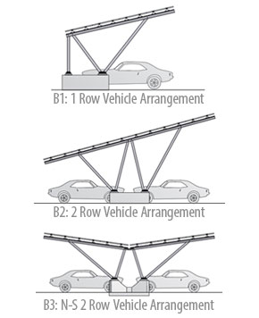
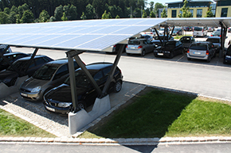

 <section class="row">

<h4>Maximize the Use of Your Space</h4>
 
Park@Sol creates new usable surfaces for solar energy while also providing shade for parking or pedestrian areas.
 The Park@Sol system is the most versatile solar carport solution on the market offering several different design options for both single and double rows of parking.
 To accommodate any site situation, customized foundation options are available including cast-in-place concrete ballasts, concrete pillars, and micropile integrations.

 Utilizing state of the art production processes, we are able to achieve longer spans between foundations reducing cost and simplifying the installation process.
 No on-site welding or cutting is necessary to construct this streamlined and architecturally pleasing solar carport.

 

 

 

 <iframe width="480" height="270" class="embed-responsive-item" src="https://www.youtube.com/embed/XdUZy_XU1uA" frameborder="0" allowfullscreen=""></iframe>
 

  

    Inovateus steers largest U.S. solar carport project under construction at Michigan State University.
      <a style="font-size: large;
    font-weight: 600;" href="https://inovateus.com/2017/07/27/inovateus-steers-largest-u-s-solar-carport-project-construction-michigan-state-university/" target="_blank">
Read Blog</a>

Park@Sol in the News with Inovateus’ Michigan State University project.  New solar panel carports could save MSU $10 million in electricity costs   <a style="font-size: large;
font-weight: 600;"  target="_blank" href="http://statenews.com/article/2017/09/new-solar-panel-carports-could-save-msu-10-million-in-electricity-costs">Read Blog</a>

 

 

 
 

 
</section>

<h4>Micropile Foundations</h4>
<section class="row">

Micropile foundation (a hollow metal rod installed deep into the ground) allows for a streamlined design and a very cost-effective system;
        less concrete material is needed to accomodate even high wind and snow loads.
        "The technology innovation of using Schletter micropiles as foundations and precast concrete pads, in addition to the engineering design ...
        cut the construction schedule in half and minimized the risk factors in a rainy environment like Florida."
    

    
--Javier Latre Gorbe, Vice-President of Technical Operations for ESA Renewables

    

<iframe class="embed-responsive-item" width="654" height="400" src="//www.youtube.com/embed/vCS8c2PU2IY?rel=0" frameborder="0" allowfullscreen=""></iframe>
    

</section>
<h4>System Benefits</h4>
<section class="row">

<ul>
       <li> Competitive pricing</li>
       <li>Structural engineering support with complete drawing packages</li>
       <li>Compatible with most module types, orientations, and inclinations up to 20°</li>
       <li>Corrosion-resistant aluminum construction</li>
       <li>Foundation types include micropile, drilled shaft, and fully ballasted</li>
       <li>Purlins can accommodate spans up to 30 ft.</li>
</ul>

</section>

<h4>We’ll Make Sure Your Project is a Success</h4>
<section class="">

<ul>
<li>Leak protection</li>
<li>Wire management</li>
<li>Inverter fastenings</li>
<li>Corrosion-resistant aluminum construction</li>
<li>Advertising space</li>
</ul>

<!--<h5>Have a look at the Park@Sol feature in <a href="http://www.solarpowerworld-digital.com/solarpowerworld/may_2013#pg23" target="_blank">Solar Power World</a></h5>-->

<h4>Additional Resources</h4>
<ul>
  <li><a class="pdf-icon" href="/support/Park@Sol-Product-Sheet.pdf" target="_blank">Park@Sol  Brochure »</a></li>
<li><a class="pdf-icon" href="support/I400160US%20Park@Sol%20Installation%20Instructions.pdf" target="_blank">Park@Sol  Installation Manual »</a></li>
<li><a class="pdf-icon" href="support/MI-078 Park@Sol Solfuturo Cummins Carport Success.pdf">Park@Sol Solfuturo/Cummins Success </a></li>
 </ul>

</section>
