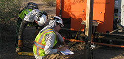

<h4>Schletter manufactures quality solar mounting systems for utility-scale, commercial, and residential PV applications.</h4>

<section class="row">

  About
<a href="about.html" >
 
Learn more about the Schletter Group.
</a>

  Team
<a href="team.html" >
 
<!--</a>-->
Three locations in North America.
</a>

  Careers
<a href="careers.html" >

We are hiring!</a>

</section>

<iframe width="330" height="186" src="https://www.youtube.com/embed/SJz4uOPe7EQ" frameborder="0" allowfullscreen></iframe>

