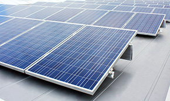

<h4> Named for its truly easy installation, the ETL Listed Fix-EZ is an affordable ballasted roof mount solution. </h4>

<h4 class="clear section">Multifunctional Components Optimize Efficiency</h4>
<section class="row">

          
Concrete blocks act as ballast weight as well as system support. 
              Module mounting rails support modules and act as windbreak with Rapid2+ module clamps securely holding modules in place while bonding/grounding them to the system.
               Engineered to be 100% IBC code compliant, the ETL Listed Fix-EZ reduces the number of components and system cost without compromising design integrity.

          <h3>System Benefits</h3>
          <ul>
         	<li>Now an ETL Listed system*</li>
            <li>Various module tilts available based on module dimensions and orientation</li>
            <li>Wind tunnel tested for low ballast</li>
            <li>Integrated grounding with ETL Listed Rapid2+ module clamps</li>
            <li>Includes mounting system and ballast blocks</li>
            <li>Designed for modules in a single row configuration either in portrait or landscape</li>
          </ul>       
 

    
    
Extremely quick to install

 </section>

<h4 class="section">Quick Installation</h4>
<section class="row">

     

<iframe width="489" height="287" class="embed-responsive-item" src="https://www.youtube.com/embed/YJFN7sy4i_c?rel=0" frameborder="0" allowfullscreen=""></iframe>

<h4>Ballasts to Modules in Four Easy Steps</h4>
<ol>
   <li>Place ballast block</li>
   <li>Bolt L-Foot connector to ballast block</li>
   <li>Tighten module-bearing rails to L-Foot assembly</li>
    <li>Secure modules to rails with Schletter Rapid2+ Grounding Module Clamps</li>
</ol>

</section>

<h3 class="section">Integrated Ballast Reduces System Cost</h3>
<section class="row">

Unique to the Fix-EZ system are durable ballast blocks
equipped with threaded steel inserts, securely connecting
system and ballast. An L-Foot, which is pre-assembled
with a KlickTop™ connector, attaches directly to the ballast
block, further simplifying installation. Depending on design
requirements, ballasts can span up to ten feet, greatly
reducing roof loads.
  

*Grounding &amp; Bonding Equipment (UL 467 and CAN/CSA-C22.2 No. 41), identified with ETL Listed Mark. See Intertek© ETL Listed Directory for more information.

 

Ideal for Commercial Installations

</section>

<section class="">

            <!---->
<h4>What to expect from Schletter</h4>
 <ul>
    <li>Full in-house engineering services </li>
    <li>20 year limited warranty on aluminum systems</li>
    <li>100% IBC 2006, 2009, 2012 code compliant systems, with
    PE wet stamps available in most states</li>
</ul>

 <h4>Additional Resources</h4>
 <ul>
        <li><a href="support/Fix-EZ-Product-Sheet.pdf"           target="_blank" target="_blank" class="pdf-icon fa fa-file-pdf-o">Fix-EZ Product Sheet »</a></li>
        <li><a href="support/Fix-EZ-Installation-Manual.pdf"     target="_blank" target="_blank" class="pdf-icon fa fa-file-pdf-o">Fix-EZ Install Manual »</a></li>
        <!--<li><a href="support/Roof-Mount-System-Overview.pdf" target="_blank" target="_blank" class="pdf-icon fa fa-file-pdf-o">Roof Mount Overview »</a></li>-->
        <li><a href="http://www.youtube.com/watch?v=YJFN7sy4i_c" target="_blank" class="video-icon fa fa-file-movie-o"> Fix-EZ Install Video »</a></li>
</ul>

</section>