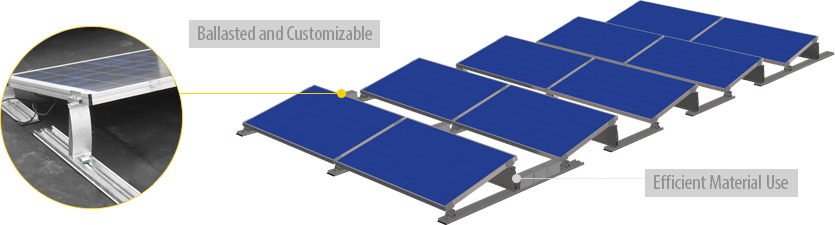
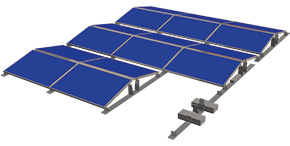

<h4>Schletter classics come together into a single, outstanding ballasted roof mount solution.</h4>

<section class="row">

<h4>Optimized Flat-Roof System</h4>

We’ve combined our years of experience in solar mounting systems to create the new FixGrid, which is greater than the sum of its parts. Using our FixZ Series rails, the system allows for versatility in module tilt while using familiar, high-quality components known to Schletter systems. The result is a cost-competitive and exceptionally easy-to-install roof mount system.

We have run this ballasted roof mount system through rigorous wind tunnel testing to help develop system architecture  which minimizes wind loads thereby reducing ballast requirements over traditional systems. We also only use rail sections where absolutely necessary to deflect wind in edge zones – minimal material means less cost, less heavy lifting, and all-around savings.

<h4 class="clear ">System Benefits</h4>
<ul>
<li>Two module tilt angle options: 6 and 13 degrees</li>
<li>Wind tunnel tested and designed for lowest required ballast</li>
<li>Optimized for material and cost efficiency</li>
<li>Designed to securely install modules in landscape orientation</li>
</ul>

Optimized for efficiency

</section>

<h4 class="section">Proven Schletter Components in a New Application</h4>

<iframe width="450" height="287" class="embed-responsive-item img-responsive" src="https://www.youtube.com/embed/7rFIGerUNyg" frameborder="0" allowfullscreen=""></iframe>

 

<blockquote>The FixGrid utilizes some of Schletter’s best components to achieve an all-new ballasted roof system which is efficient in both material and install time while achieving a light footprint. </blockquote>

<h4 class="section">Various Configuration Options</h4>
 
 <section class="row">
 

As with most Schletter mounting systems, we designed the FixGrid with customizability in mind to help you find the ideal system, no matter the site requirements. The standard FixGrid covers those south-facing installations, while the FixGrid 100 is there for sites requiring east-west-facing modules. Additionally, two tilt angle options are available (exact tilt is module dependent) to optimize power output regardless of project location.

 

 

      
Two Configurations and Two Tilt Options

 
 

 </section>

 

 <section class="">

            <!---->
<h4>What to expect from Schletter</h4>
        <ul>
            <li>Full in-house engineering services </li>
            <li>20 year limited warranty on aluminum systems</li>
            <li>100% IBC 2006, 2009, 2012 code compliant systems, with
              PE wet stamps available in most states</li>
        </ul>

          <h4>Additional Resources</h4>
        <ul>
            <li><a href="support/FixGrid-Product-Sheet.pdf" target="_blank" class="pdf-icon fa fa-file-pdf-o"> FixGrid Product Sheet »</a></li>
            <li><a href="support/FixGrid-Installation-Manual.pdf" target="_blank" class="pdf-icon fa fa-file-pdf-o"> FixGrid Install Manual »</a></li>
            <li><a href="https://www.youtube.com/watch?v=7rFIGerUNyg&amp;feature=youtu.be" target="_blank" class="video-icon fa fa-file-movie-o"> FixGrid Install Video »</a></li>
        </ul>
 

 </section>