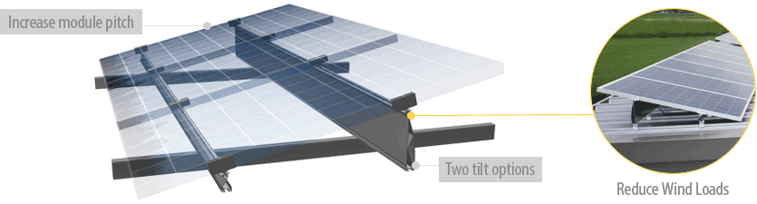
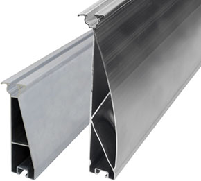

<h4>Low-pitch roofs are a problem of the past!</h4>
 
<h4 class="section">Add Tilt to Your Module, Add Power to Your Output</h4>
<section class="row">

The FixZ Series of rails helps increase power output on  low-slope roofs by adding inclination to the modules. This series offers two  options for modules 130 cm tall to 170 cm tall in portrait orientation only: 

<ol>
<li>The FixZ-7 – from 5 to 7 degrees of added tilt</li>
<li>The FixZ-15 – from 12 to 15 degrees of added tilt</li>
</ol>
<h4>System Benefits</h4>
<ul>
<li>Improved power output on low-sloped roofs</li>
<li>Increased ventilation and self-cleaning of modules</li>
<li>Distributes loading evenly</li>
<li>Quickly and easily fastens to Schletter roof attachments with the proven KlickTop connection system</li>
</ul>

  

The FixZ-7 and FixZ-15 Back Rails

</section>

<h4 class="section">Quick Installation</h4>
<section class="row">

        

<iframe width="450" height="287" class="img-responsive" src="http://www.youtube.com/embed/ZzEXhFSdSDA?rel=0" frameborder="0" allowfullscreen=""></iframe>
        

FixZ Series Rails come as a set of two, a taller back rail paired with a shorter front rail. By way of Schletter’s KlickTop and KlickTop HB, the FixZ Series easily attaches to any roof type using Schletter roof attachments or S-5!® standing seam clamps. Modules can then be quickly attached to the FixZ-7 or FixZ-15 rails using Schletter module clamps.

</section>

<h4 class="section">Check out the FixZ Series rails in their new role in the Fix-EZ ballasted roof mount system! <a href="fix-ez.html">Click here »</a></h4>

<section class="">

<!---->
<h4>What to expect from Schletter</h4>
<ul>
<li>Full in-house engineering services</li>
        <li>20 year limited warranty on aluminum systems</li>
        <li>100% IBC 2006, 2009, 2012 code compliant systems, with
          PE wet stamps available in most states</li>
</ul>

<h4>Additional Resources</h4>
 <ul>
        <li><a class="pdf-icon fa fa-file-pdf-o" href="support/FixZ-7-Product-Sheet.pdf" target="_blank"> FixZ-7 Product Sheet »</a></li>
        <li><a class="pdf-icon fa fa-file-pdf-o" href="support/FixZ-15-Product-Sheet.pdf" target="_blank"> FixZ-15 Product Sheet »</a></li>
        <li><a class="pdf-icon fa fa-file-pdf-o" href="support/FixZ-Install-Manual.pdf" target="_blank"> FixZ Install Manual »</a></li>
        <li><a class="video-icon fa fa-file-movie-o" href="http://www.youtube.com/watch?v=ZzEXhFSdSDA" target="_blank"> FixZ-15 Install Video »</a></li>
</ul>
 

</section>