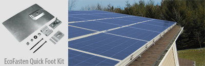

<h4>For any pitch, any roof, any time. Easy-to-install, cost-effective, customized solutions for home or business.</h4>        
<section class="row">

<h3>System Benefits</h3>
<ul>
    <li>100% aluminum rails, lightweight and corrosion resistant</li>
    <li>Designed for fast and easy installation</li>
    <li>ETL listed module grounding clamps</li>
    <li>No grounding lugs or copper wire needed!</li>
    <li>In-house engineering services</li>
    <li>Custom options for nearly any roof type</li>
    <li><a href="http://secure.schletter.us/calculator/index.php">Design and purchase online »</a></li>
    <li><a href="support/fireRatingFlush033115.pdf">Conforms to UL Subject 2703 and is Certified to ULC/ORD Standard C 1703S </a></li>
</ul>

<iframe  class="embed-responsive-item img-responsive" src="http://www.youtube.com/embed/pZQRPU4vL7A?rel=0" frameborder="0" allowfullscreen=""></iframe>

</section>

<section class="row">

We offer mix and match flush mount components, with options for nearly any roof type or module layout. All flush mounts include three key components:

1. Roof Attachments

2. Module Carrying Rails

3. Module Clamps

Safely secure PV modules to nearly any roof type, regardless of wind and snow load requirements.

</section>

<section class="row">

</section>
<h4 class="section">1. Roof attachments</h4>
<section class="row">

        
Select from a variety of Schletter’s standard roof hooks for asphalt shingle or tile roofs. Also available through Schletter are partner products compatible with Schletter systems, including Quick Mount PV® and EcoFasten® flashed asphalt shingle roof attachments.

        
Schletter offers easy-to-use S-5!® Clamps for standing seam metal roofs, which are compatible with other Schletter components.

        
For trapezoidal sheet metal roofs, use Schletter’s Fix2000 or Single Fix-V.

        
Browse our <a href="support/Components-Overview.pdf">Component Overview </a>to view all Schletter components.

     
      

</section>

<h4 class="section">2. Module carrying rails</h4>

<section class="row">

Directly connect to the roof attachments using Schletter’s unique KlickTop connector, greatly reducing installation time.

Select from the standard Solo05 rail, the Profi05 rail with integrated wire management, or the ProfiPlus05 for increased roof clearance (also dependent on snow/load requirements).
Free in-house engineering services can determine the most cost-effective rail to support the system span.

 When additional pitch is needed on low-pitch roofs, the FixZ Series offers an additional 7 or 15 degrees of module tilt. 

 

 

</section>

<h4 class="section">
NEW! Schletter Client Portal for instant online ordering of most flush mount components! 
<a href="http://secure.schletter.us/" target="_blank">Sign up for an account »</a></h4>

<h4 class="section">3. Module clamps</h4>
<section class="row">

There is no faster way of clamping modules than the ETL listed Rapid2+ Clamp. 
Simply snap the clamp into the rail and tighten to quickly mount modules to a Schletter Flush Mount System. 

</section>

<section class="">

 <!---->
<h4>What to expect from Schletter</h4>
<ul>
<li>Full in-house engineering services </li>
<li>20 year limited warranty on aluminum systems</li>
<li>100% IBC 2006, 2009, 2012 code compliant systems, with
PE wet stamps available in most states</li>
</ul>

<h4>Additional Resources</h4>
<ul>
<li><a class="pdf-icon" href="support/Standard-Flush-Mount-Installation-Manual.pdf" target="_blank" class="pdf-icon fa fa-file-pdf-o"> Flush Mount Install Manual »</a></li>
<li><a class="pdf-icon" href="support/Roof-Mount-System-Overview.pdf" target="_blank" class="pdf-icon fa fa-file-pdf-o" > Roof Mount System Overview »</a></li>
<li><a class="pdf-icon" href="support/Components-Overview.pdf" target="_blank" class="pdf-icon fa fa-file-pdf-o"> Components Overview »</a></li>
</ul>

</section>