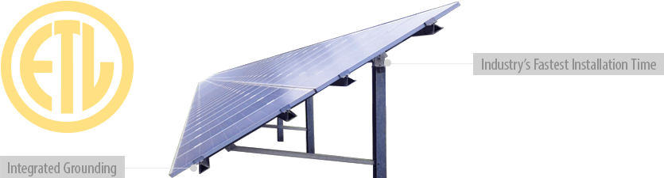
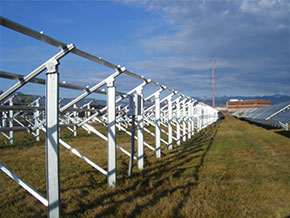
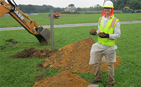
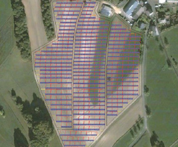
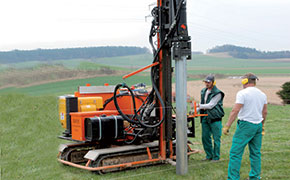
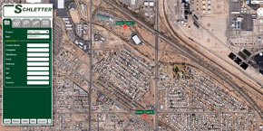

<h4> The FS System, with over 6GW of installed power worldwide, reduces installation time and costs. </h4>

<section class="row">
  

The FS System is designed to be the most cost-competitive solution for large-scale solar mounting systems, with proprietary aluminum extrusions to reduce material usage and the highest level of in-house pre-assembly on the market. The result is an attractive solar mounting system installed quickly and with the durability to last.

<h3>System Benefits</h3>
<ul>
  <li>ETL Classifed</li>
  <li>High level of pre-assembly for fast installations</li>
  <li>Easily accessible for ground and system maintenance</li>
  <li>Certified engineering by professional engineer licensed in the location of the project</li>
<li>20 year warranty</li>
</ul>

For use with nearly any module

</section>

<section class="row" style="margin-top:10px;">   
<!--

<iframe class="embed-responsive-item"  src="https://www.youtube.com/embed/gYg4qnMirbg?rel=0" frameborder="0" allowfullscreen></iframe>

-->

<blockquote>Proprietary post design and rail extrusions make the FS System lean, solid, and easy to install.</blockquote>

<h4>Five simple steps are done in the field:</h4>
<ul>
        <li>Drive the post into the ground</li>
        <li>Mount head assembly</li>
        <li>Place the support on the post attachment head and bolt the lower strut</li>
        <li>Insert the locking plate at the attachment head</li>
        <li>Install the cross beams—that's it!</li>
</ul>

</section>

<section class="row">

<h4>Geotechnical Testing</h4>
    
To determine the number of posts required and embedment depth, geotechnical testing is required for all project sites. Such
        testing generally requires numerous soil samples
        and subsequent soil classifications, which are
        the basis for determining the quantitative bearing
        capacity.

      <h3>Testing Includes:</h3>
      <ul>
        <li>Vertical pull-out tests</li>
        <li>Lateral load tests</li>
        <li>Independent laboratory analysis of soil classification, corrosion potential, gradation, and soil plasticity</li>
      </ul>
      
<a href="services.html">Schletter’s Value Add Services &raquo;</a>

    

</section>

<h4>Helios 3D™ - Layout Software</h4>

Testing for post embedment depth

<section class="row">

        
Cut design time for commercial or utility-scale projects nearly in half with Helios 3D layout software. Helios 3D features automatic, shadow-free placement of PV tables, making planning large scale systems virtually seamless. The program’s sophisticated design tools and intuitive workflow allow users to complete days’ worth of project work in hours.

          
A two-part software system, Helios 3D consists of database management
and an AutoCAD-based drafting interface.

<a href="helios-3d.html">More about Helios 3D &raquo;</a>

  

  
Helios 3D Generated Layout Image

 
    
  
</section>

<section class="row">

     

Cut design time for commercial or utility-scale projects nearly in half with Helios 3D layout software. Helios 3D features automatic, shadow-free placement of PV tables, making planning large scale systems virtually seamless. The program’s sophisticated design tolls and intuitive workflow allow users to complete days’ worth of project work in hours.

A two-part software system, Helios 3D consists of database management
and an AutoCAD-based drafting interface.

<a href="helios-3d.html">More about Helios 3D &raquo;</a>

</section>

<section class="row">

Try PV Groundbreaker, a free online software, to estimate the power potential of your solar mounting system. Simply enter in your project details and land area, and PV Groundbreaker will calculate the amount of modules and racks needed, shading distance, and an estimate of the potential energy produced.

Visit <a href="http://www.pvgroundbreaker.com">www.pvgroundbreaker.com »</a>

 

 

 
 

</section>

<section class="">

<!---->
<h4>What to expect from Schletter</h4>
        <ul>
          <li>Full in-house engineering services </li>
          <li>20 year limited warranty on aluminum systems</li>
          <li>100% IBC 2006, 2009, 2012 code compliant systems, with
            PE wet stamps available in most states</li>
        </ul>

        <h4>Additional Resources</h4>
        <ul>
          <li><a class="pdf-icon" href="support/FS-System-Product-Sheet.pdf" target="_blank">FS System Product Sheet »</a></li>
          <li><a class="pdf-icon" href="support/FS-System-Install-Manual.pdf" target="_blank">FS System Install Manual »</a></li>
  <li><a href="http://www.pvgroundbreaker.com" target="_blank">@ PV Groundbreaker »</a></li>
        </ul>

</section>