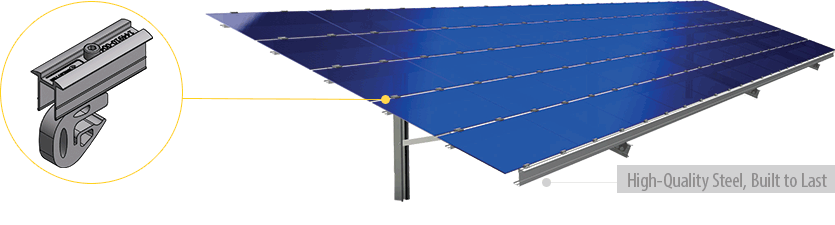
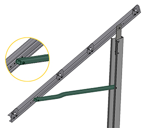
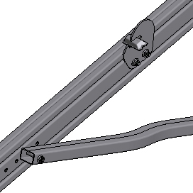
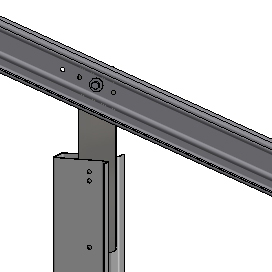

<h4>Re-engineered with less parts</h4>

<h4>FS Uno Saves Time and Money with 15% Reduction in Parts</h4>
<section class="row">

Based on Schletter's legendary FS System, 
this 100% galvanized steel option has been re-engineered making it stronger while reducing the overall parts needed for the project.
The FS Uno is known for its product longevity and is highly prefabricated to offer a long term ground mount solution that is even faster to install with the new design. 
An estimated savings of $10-$12 per kw installed is possible. The FS Uno surpasses the competition in affordability, ease-of-installation, 
and quality by meeting or exceeding all applicable IBC and ASCE standards. Also engineered for versatility, the FS Uno offers two distinct configurations: 
traditional south facing or east-west facing for unique layout situations (FS Uno-100).

<h4>System Benefits</h4>
<ul>
 <li>Re-engineered with 15% less parts saving you time and money</li>
<li>100% galvanized steel mounting system</li>
<li>High level of pre-fabrication and the design makes it faster than ever before to install</li>
<li>Increased distance between foundation supports reduces material costs</li>
<li>Engineered to make the connection between the girder and the strut even stronger </li>
<li>There is less hardware which means less to manage and lose onsite </li>
</ul>

The FS Uno upholds Schletter quality standards.

</section>

 <!-- <h3 class="section">Quick Installation</h3>-->
<section class="row">

  
  
         
Less parts make this connection stronger and faster to install.

 
Consistent use of M12 hardware requires less tools.

</section>

<h4 class="section">Quality</h4>
<section class="row">

The FS Uno System has been wind tunnel tested, meets IBC standards and has a lateral post placement tolerance of ± 5” and post verticality tolerance of more than 2”. 
The FS Uno upholds the quality standards for which Schletter is known. 

Schletter's custom module clamps accomodate nearly any size framed solar panel in the industry.

Clamps accommodate nearly any framed module.

</section>

<h3 class="section">Free Web App - Estimate your power potential</h3>
<section class="row">
    

Try PV Groundbreaker, a free online software, to estimate the power potential of your solar mounting system. 
Simply enter in your project details and land area, and PV Groundbreaker will calculate the amount of modules and racks needed,
shading distance, and an estimate of the potential energy produced.

Visit <a href="http://www.pvgroundbreaker.com">www.pvgroundbreaker.com »</a>

   

   

   
   

</section>

 

 <section class="">
  

    <!---->
    <h4>What to expect from Schletter</h4>
    <ul>
     <li>Full in-house engineering services </li>
     <li>Standard 20 year limited warranty</li>
     <li>100% IBC 2006, 2009, 2012 code compliant systems, with
PE wet stamps available in most states</li>
 </ul>

   

   

  <h4>Additional Resources</h4>
    <ul>

   <li><a class="pdf-icon" href="support/FS-Uno-Product-Sheet.pdf" target="_blank">FS Uno Product Sheet »</a></li>
     <li><a class="pdf-icon" href="support/FS-Uno-Installation-Manual-Portrait.pdf" target="_blank">FS Uno Install Manual »</a></li>
      <li><a  href="http://www.pvgroundbreaker.com" target="_blank">@ PV Groundbreaker »</a></li>
 </ul>
 
</section>