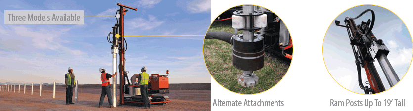
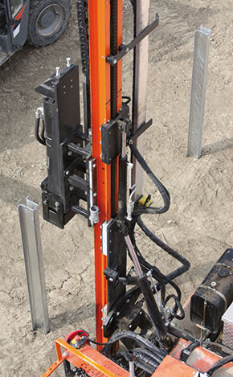

<h4>Reduce cost and time investment from the installation of utility and commercial scale ground mount PV systems.</h4>
 

<h4 class="section">Specialized Machinery for Rapid Post Installation</h4>

<section class="row">

The GAYK Hydraulic Ram is an easy-to-operate piece of heavy machinery engineered to reduce installation times and costs of large scale PV systems. 
    Several machine model options and alternate attachments make GAYK the best option to achieve the most efficient workflow on any job site.

<h4>Benefits Offered by GAYK</h4>
<ul>
<li>Intuitive walk-along controls</li>
<li>Engineered for easy maintenance</li>
<li>Passive mast position for easy transportation</li>
<li>Easily swapped alternate attachments available</li>
<li>Solidly based on rubber tracks for difficult terrain and slopes up to 20 degrees</li>
<li>Average installation speeds approaching 250 posts over an 8-hour work day, rates of over 300 posts/day have been reached</li>
</ul>

<h4>Exclusively Distributed by Schletter</h4>

Schletter currently carries 3 different GAYK pile driver models and is the exclusive distributor of this machinery in North and South America.
Ram models offer a range of mechanical capabilities to ensure that you get the right ram for the job at the right place. 
Schletter also carries alternate attachments including a post puller and drill unit.

<iframe class="embed-responsive-item" src="https://www.youtube.com/embed/WXa9L-Y4Gnc" frameborder="0" allowfullscreen></iframe>

</section>

<h4>Purchase or rental pricing as well as training available upon request by emailing <a href="mailto:mail@schletter.us">mail@schletter.us</a> or calling (888) 608-0234.</h4>

<h4>Additional Resources</h4>
<ul>
<li><a class="pdf-icon" href="support/GAYK-Ram-Product-Sheet.pdf" target="_blank">GAYK Product Sheet »</a></li>
<li><a class="" href="http://secure.schletter.us/mm5/merchant.mvc?Screen=CTGY&amp;Category_Code=GAYK">Gayk Ram / Parts »</a></li>
</ul>

