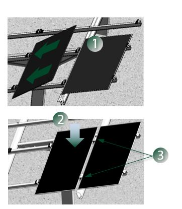

   

<h4 style="color:#004628">Download Brochures</h4>
<ul  style="list-style-type:none;padding:0;">

<li><a class="pdf-icon" href="/support/MI-074%20G-Max%20Brochure.pdf" target="_blank">G-Max Brochure »</a></li>
<li><a class="pdf-icon" target="_blank" href="http://www.firstsolar.com/-/media/First-Solar/Technical-Documents/Series-4-Datasheets/Series-4-Module-Datasheet---V3-103116-(1).ashx">
First Solar Series 4 »</a></li>
</ul>
<a class="action-button" style="text-align:center;margin-left:30px;    background-color: #004628;
    border-radius: 2px;
    color: #fff;
    font-size: .8em;
    padding: 10px 15px 10px;
    margin: 15px 10px 20px 10px;
    display: inline-block;
    font-weight: bold;
    position: relative;
    overflow: visible;" href="http://www.schletter.us/contact-schletter.html">contact us</a>

<h3 style="font-weight:600">Schletter’s Innovative G-Max Ground Mount System Available With First Solar Series 4™ Modules</h3>

Schletter offers the next generation of racking with G-Max.
Quality mounting, exceptional ease-of-assembly in the field, and competitive pricing—all in a steel mounting system.
 Now, with the Schletter / First Solar partnership, the First Solar Series 4 modules can be installed with G-Max.

<h4>A Winning Combination:  Schletter’s G-Max with First Solar’s FastMount™ Rafter, Series 4 Modules™, and FastClamps</h4>

<h4 style="font-weight:600">G-Max Features and Benefits</h4>
<ul>
<li>Thoughtful, streamlined design, available with add-on component for First Solar Series 4 modules</li>
	<li>Fixed-tilt racking system ideally suited for utility-scale installations</li>
  	<li>Single person installation of girder, head adapter, and strut</li>
    <li>Components optimized for strength, safety, and fast installation</li>
<li>20 year limited warranty</li>
</ul>

<h4 style="font-weight:600">First Solar Series 4 Modules Easily Installed on G-Max</h4>
<ul>
  <li>Use proven FastMount™ Rafter to integrate First Solar Series 4 modules on G-Max.</li>
  <li>FastMount Rafter has been installed in more than 3 GW of solar projects.</li>
  <li>Reduce labor and part count in the field with pre-installed FastMount™ clips.</li>
  <li>Easily install First Solar Series 4 Modules on G-Max ground mount system with FastClamps.</li>
</ul>

For more information, please call us at <strong>(888) 608-0234</strong> or   <a href="http://www.schletter.us/contact-schletter.html">contact us</a> online to learn more about Schletter’s G-Max and First Solar’s Series 4 modules.

<iframe  class="embed-responsive-item" src="https://www.youtube.com/embed/cB6KMAeyOCc" frameborder="0" allowfullscreen></iframe> 

<h2 style="font-size:14px;"> Single person installation of girder, head adapter, and strut.
           Watch this quick video installation.</h2>   

<!--
 <h2 style="font-size:14px;">Single person installation of girder, head adapter, and strut.
  Watch this quick video installation.</h2>

-->

<h2 style="font-size:14px;">First Solar Series 4 modules installed on Schletter racking system</h2>

 <h2 style="font-size:14px;">FastMount system protects module integrity and simplifies installation.</h2>

<!---->
        <h4>What to expect from Schletter</h4>
        <ul>
          <li>Full in-house engineering services </li>
        <!--  <li>20 year limited warranty on aluminum systems, 5 year on steel systems</li>-->
          <li>100% IBC 2006, 2009 , 2012, or 2015 code compliant systems, with PE wet stamps available in most states</li>
        </ul>
      

 <h4>Additional Resources</h4>
<ul>

 <li><a class="pdf-icon" href="/support/MI-074%20G-Max%20Brochure.pdf" target="_blank">G-Max Brochure »</a></li>
 <li><a class="pdf-icon" href="/gayk.html" target="_blank">Learn more about GAYK Hydraulic Rams »</a></li>
  <li><a class="pdf-icon" href="/support/MI-069%20G-Max%20Installation%20Manual%20V2.pdf">G-Max Installation Manual »</a></li>
 <li><a class="pdf-icon" href="/support/Ground-Mount-Checklist.pdf">Ground Mount Checklist »</a></li>
</ul>

