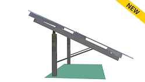
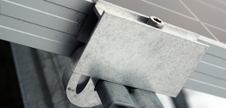
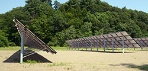
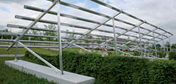
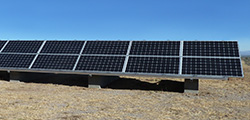

---
layout: page
title: Ground Mount Systems
description: Schletter's Ground Mount System
---    

<h3>Highly pre-assembled penetrating mounting systems.</h3>

     

             <a href="gmax.html">G-Max™ 
             </a> 
             For Utility Applications
        

 
  
            <a href="fs-uno.html">FS Uno™ 
            </a> 
            All Steel, Pile-Driven
        

 

            <a href="fs-system.html">FS System™ 
            </a> 
            Aluminum, ETL Classified
 
       

<h3> Easy-to-install ballasted solar mounting systems.</h3>

       

            <a href="pvmax.html">PvMax™ 
            </a> 
            For landfills or uneven terrain

        
 
            <a href="pvmini.html">PvMini™ 
            </a> 
             Smaller Foundations, Less Invasive

        

            <a href="http://secure.schletter.us/mm5/merchant.mvc?Store_Code=S&amp;Screen=CTGY&amp;Category_Code=14">PvMini Mounting Kit™ 
            </a>
        Residential, Ballasted Concrete Blocks
 

  
