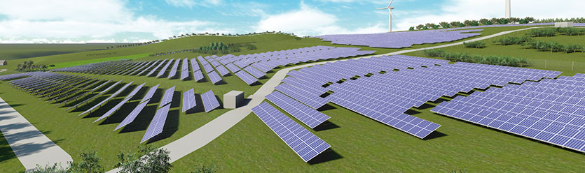

--- 
layout: page
title: Helios 3D
description: Helios 3D is a premier design software for utility scale PV solar systems for both ground and roof areas.
---
<a class="pdf-icon" href="support/Helios3D-Product-Sheet.pdf">PDF </a>
<h3>Looking for a robust tool for PV plant design and engineering?</h3>
<!---->
<h3 class="section">Complete Days Worth of Solar Mounting Project Planning in Hours!</h3>

<section class="row">

Helios 3D is a premier design software for utility scale PV solar systems for both ground and roof areas. This two-part software consists of database management paired with an AutoCAD-based drafting interface which can automatically place 3-dimensional solar racking in a 3-dimensional space.

 
</section>

<section class="row">

<!-- accordian -->

<h4 class="panel-title"><a  href="#collapse1" data-toggle="collapse" data-parent="#accordion" class="contentaccord">Database Features »</a></h4>

    
Through its SQL database framework, Helios 3D supports:

<ul  class="panel-body">
<li>Project Development and Project Layout with stored racking systems and modules</li>
<li>Project Engineering with bill of materials and post coordinates</li>
<li>Evaluation and Documentation with storage for Excel© and Word© documents as well as PDF and DWG files</li>
</ul>

<h4 class="panel-title"><a href="#collapse2" data-toggle="collapse"  data-parent="#accordion" class="contentaccord">CAD Features »</a></h4>

With state of the art functions, Helios 3D surpasses all other PV layout tools on the market:

<ul class="panel-body">
  <li>Automatically calculated rack placement</li>
  <li>Shadow object calculation at any time and day of the year</li>
  <li>Terrain analysis and calculation of earth movement possible through Civil 3D</li>
  <li>Field alignment and layout with row distance specification and row numbering</li>
  <li>Many more!</li>
</ul>

<h4 class="panel-title"><a href="#collaspe3" data-toggle="collapse"  data-parent="#accordion"  class="contentaccord">Terrain Analysis »</a></h4>

Using a Digital Terrain model, projects sites can be evaluated before valuable time is wasted in planning and construction:

<ul class="panel-body">
<li>Create a Digital Terrain Model using data from Google Earth, USGS, Surveyors Data File Report, or AutoCAD files with points and contours</li>
<li>Rapidly assess any particular tract of land to determine its suitability for the proposed project</li>
<li>Save time and money in planning and construction by recognizing terrain constraints in initial analysis</li>
</ul>

<h4 class="panel-title"><a href="#collaspe4" data-toggle="collapse"  data-parent="#accordion"  class="contentaccord">Electrical Design Upgrade »</a></h4>

New Electrical Design Upgrade!

<ul class="panel-body">
<li>Create custom electrical device hierarchies</li>
<li>Create string assignments</li>
<li>Design cable trenching and apply it to the physical rack layout</li>
<li>Determine equipment quantities and cable lengths</li>
</ul>

</section>

<section class="row">

<iframe width="510" height="287" src="http://www.youtube.com/embed/JQW4ypzhQWY?rel=0" frameborder="0" allowfullscreen=""></iframe>

<h3>Software Support</h3>

Schletter will provide Helios 3D pricing as well as training upon request. Email <a href="mailto:helios.3d@schletter.us">helios.3d@schletter.us</a> for more information. 

</section>

<section>

<blockquote>Discover the potential power output of any plot of land on the planet! PV Groundbreaker — the free online project feasibility tool from the developers of Helios 3D. <a href="http://www.pvgroundbreaker.com/helios2d/login.aspx">Try it now »</a>
</blockquote>

<h4>Additional Resources</h4>
<ul>
<li><a class="pdf-icon" href="support/Helios3D-Product-Sheet.pdf" target="_blank">Helios 3D Product Sheet »</a></li>
<li><a class="video-icon" href="http://www.youtube.com/watch?v=JQW4ypzhQWY" target="_blank">Helios 3D Video »</a></li>
</ul>

</section>

