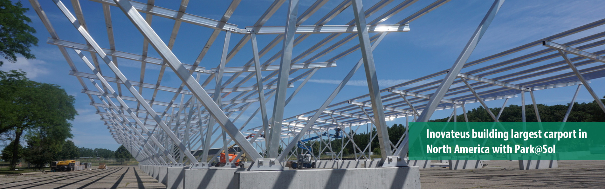
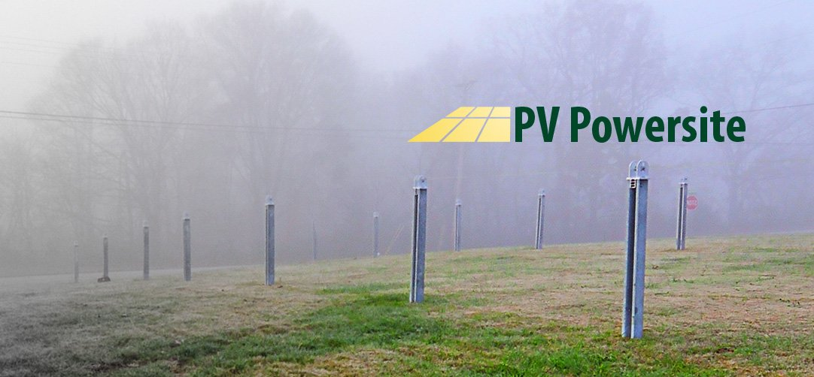

<!--# {{ page.title }}-->
<!--
-->

   <!-- -->
    <!---->

 a" data-cycle-pause-on-hover="true" data-cycle-fx="fadeOut" data-cycle-timeout="3000" data-cycle-caption-plugin="caption2"> 
<!--

-->
<!--SLIDER -->

<!---->

 <!--SLIDER END -->

<!--
--> <!-- end  leaf image container -->

<a href="#main-copy">

</a>

<!-- Content end-->

<!--<h2>Save America’s Solar Jobs</h2>

U.S. ITC finds injury in Section 201 trade case involving Suniva and SolarWorld. SEIA will continue to advocate on behalf of the solar industry during the next phase of this proceeding. To learn more

 Visit <a href="http://www.seia.org/trade" target="_blank">www.seia.org/trade</a> for more details. 
 
Watch the video to learn more about solar manufacturing jobs, the impact, and what you can do to take action. 

<iframe class="embed-responsive-item"  style="padding-top:11px"  src="https://www.youtube.com/embed/SJz4uOPe7EQ" frameborder="0" allowfullscreen></iframe>

-->

<h2>Solar Mounting Systems and Metal Fabrication</h2>

A leading producer of innovative light metal products, Schletter develops and produces solar mounting systems and sustainable products from aluminum and high-grade steel. Internationally, the company is constantly evolving and has become a globally recognized supplier of products in the areas of solar technology, traffic engineering, trade shows, and environmental technology, as well as in customized solutions. In North America our focus and reputation has evolved with manufacturing innovative solar mounting systems.

<h2><a href="/blog.html">RECENT BLOGS</a></h2>

 <ul><li><a href="{{ post.url }}">{{post.title}}  </a> {{ post.date | date: '%B %d, %Y' }}</li></ul> 


<a href="https://mailchi.mp/schletter/subscribe-to-schletter-blog" class="btn" target="_blank" style="background-color:#06805C; color:#fff;" role="button">Subscribe</a>

  

 

<h2>Ground Mount</h2>

Highly pre-assembled penetrating and ballasted solar mounting systems

<a class="info" href="ground-mount.html">More info</a>

 
<!-- End Ground -->

<h2>Roof Mount</h2>

Offering fast and easy ballasted and penetrating solar mounting systems

<a class="info" href="roof-mount.html">More info</a>

 
<!-- end Roof -->

 <!-- end row -->

<h2>PvPowersite</h2>

A free web app to easily design and purchase a system online.

<a class="info" href="http://www.pvpowersite.com">More info</a>

 
<!-- endPowersite -->

<h2>Carport</h2>

Maximize the use of your space

<a class="info" href="carport.html">More info</a>

 <!-- Carport -->

 <!-- end second row-->

<h2>Gayk</h2>

Specialized machinery for rapid post installation

<a class="info" href="gayk.html">More info</a>

 <!-- Gayk -->

<h2>Shop Online</h2>

Design and buy online

<a class="info" href="http://secure.schletter.us">More info</a>

 <!-- Store -->

 <!-- end of third row-->

<a href="#main-copy">

</a>

<h3>International Production &#151; Setup Globally.</h3>

The Schletter Group now produces quality solar mounting systems all over the world. With its own production facilities in Germany, United States, Canada, China and South Africa and additionally a competent network of service and sales companies on all 5 continents, we do not only ensure the highest standards of production, exemplary flexibility, efficient logistics and delivery capability, but also fast accessibility and permanent availability for all our customers worldwide.

<!--
You can use HTML elements in Markdown, such as the comment element, and they won't be affected by a markdown parser. However, if you create an HTML element in your markdown file, you cannot use markdown syntax within that element's contents.
-->