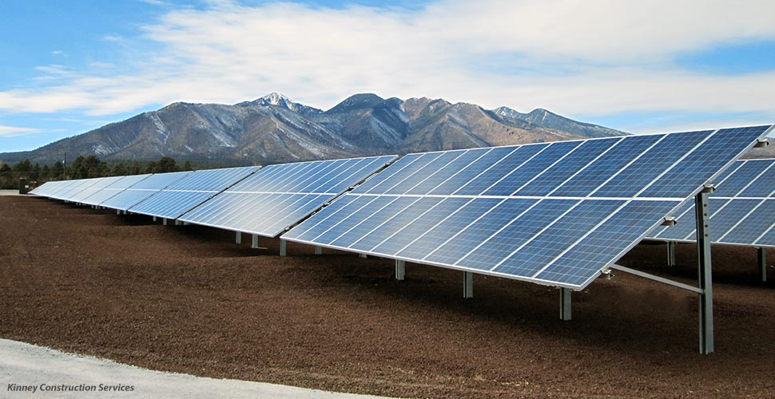

<ul id="TopNavTest" class="nav nav-tabs ">
<li class="active"><a id="TopNav1" href="#tabs-1" data-toggle="tab">Utility-Scale Systems</a></li>
<li><a id="TopNav2" href="#tabs-2" data-toggle="tab" >Commercial Systems</a></li>
<li class=""><a id="TopNav3" href="#tabs-3" data-toggle="tab">Carports</a></li>
<li ><a id="TopNav4" href="#tabs-4" data-toggle="tab">Residential Systems</a></li>

</ul>

 a" data-cycle-pause-on-hover="true" data-cycle-fx="fadeOut" data-cycle-timeout="3000" data-cycle-caption-plugin="caption2">

 a" data-cycle-pause-on-hover="true" data-cycle-fx="fadeOut" data-cycle-timeout="3000" data-cycle-caption-plugin="caption2">
<a href="images/install-residential-parapet-mount-dc.jpg" data-cycle-title="4 kW • Parapet Mount" data-cycle-desc="Tilt: 3° | Washington, DC | Modules: Sharp">

<!--<h2>4 kW • Parapet Mount</h2>flush-mount.html
Tilt: 3° | Washington, DC | Modules: Sharp
--></a>

 a" data-cycle-pause-on-hover="true" data-cycle-fx="fadeOut" data-cycle-timeout="3000" data-cycle-caption-plugin="caption2">

 <!-- End of Tabs 1-->

 a" data-cycle-pause-on-hover="true" data-cycle-fx="fadeOut" data-cycle-timeout="3000" data-cycle-caption-plugin="caption2">

