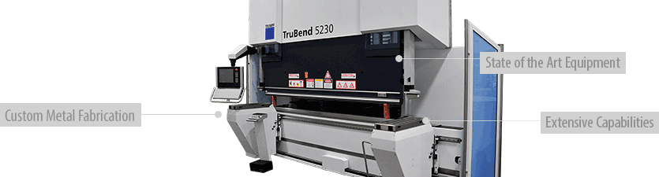
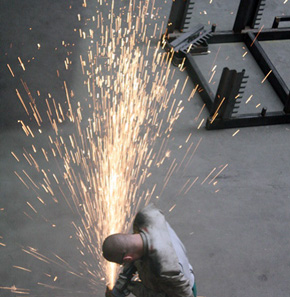
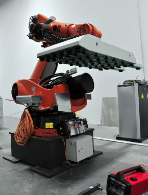

<h4>Let the newest machinery and 40 years of experience manufacture your custom metal products</h4>
 					
<h4 class="clear section">Streamlined, Automated, Ready</h4>

<section class="row">

In addition to solar mounting systems, Schletter offers custom metal manufacturing backed by over 40 years of experience in the fabrication of steel and aluminum products.
With two manufacturing facilities in the United States, a wide variety of the most state-of-the-art machinery, and a highly-skilled workforce, 
we have the capacity to provide very short turnaround times on projects of any size.

<h3>We offer a full spectrum of processes:</h3>
<ul>
<li>Rapid prototyping</li>
<li>Sheet metal cutting, punching, and bending</li>
<li>Steel and aluminum profile machining</li>
<li>Welding</li>
<li>Hardware insertion</li>
<li>Finishing</li>
<li>Saw blade sharpening, repair, and sales</li>
</ul>

Metal Works

</section>
<h3 class="section">A Preview of Some of our Machines</h3>

<section class="row">

      <iframe class="embed-responsive-item"  src="https://www.youtube.com/embed/vXEvMZS-L_Q" frameborder="0" allowfullscreen=""></iframe>

    <blockquote>Schletter produces custom metal components that are Built to SPEQ</blockquote>
<ul>
    <li>Service — and support throughout the project</li>
    <li>Price — competitive pricing through automation and streamlined processes</li>
    <li>Ease — capacity for prototyping, small lot sizes, and large production runs</li>
    <li>Quality — PPAP Equipped and in-house engineering and production team support for the best final product</li>
</ul>

</section>

  
                 
<section class="row"> 

<h4 class="panel-title"><a  href="#collapse1" data-toggle="collapse" data-parent="#accordion" class="contentaccord">Laser Cutting »</a></h4>

<ul class="panel-body" >
<li>Trumpf TruLaser 5030 </li>
</ul>

<h4 class="panel-title"><a  href="#collapse2" data-toggle="collapse" data-parent="#accordion" class="contentaccord">Cutting »</a></h4>

<ul class="panel-body">
<li>Centurio Metal Coil Cutting Center</li>
    <li>RAS 86.43 Shear</li>
    <li>Kaltenbach Cold Saw</li>
    <li>Elumatec MGS 142 Saw and SA 142 Saw</li>
    <li>Pressta Eisele Sawing Center</li>
</ul>

 

<h4 class="panel-title"><a  href="#collapse3" data-toggle="collapse" data-parent="#accordion" class="contentaccord">Punching »</a></h4>

<ul class="panel-body" >
            <li>Peddinghaus Ironworkers</li>
            <li>Burkhardt H-Series Punch</li>
        </ul>

<h4 class="panel-title"><a  href="#collapse4" data-toggle="collapse" data-parent="#accordion" class="contentaccord">CNC turret Punching »</a></h4>

<ul class="panel-body">
<li>Trumpf TruPunch 5000</li>
 </ul>

<h4 class="panel-title"><a  href="#collapse5" data-toggle="collapse" data-parent="#accordion" class="contentaccord">CNC Bending »</a></h4>

<ul class="panel-body" >
<li>Trumpf TruBend 5230</li>
<li>Trumpf TruBend 7036</li>
<li>RAS 79.26-2 Multibend-Center</li>
<li>RAS 63.30 XL-Center</li>
<li>RAS 75.06-2 XXL-Center</li>
<li>Schechtl MAB 310/CNC</li>
</ul>

<h4 class="panel-title"><a  href="#collapse6" data-toggle="collapse" data-parent="#accordion" class="contentaccord">Machining »</a></h4>

<ul class="panel-body" style="">
    <li>Elumatec SBZ-151</li>
</ul>

<h4 class="panel-title"><a  href="#collapse7" data-toggle="collapse" data-parent="#accordion" class="contentaccord">Welding »</a></h4>

        <ul class="panel-body">
            <li>Fronius Welding Cell </li>
            <li>Fronius and Cloos (MIG) Welding Machines </li>
            <li>Certified welders on staff</li>
</ul>

<h4 class="panel-title"><a  href="#collapse8" data-toggle="collapse" data-parent="#accordion" class="contentaccord">Hardware Insertion »</a></h4>

<ul class="panel-body" >
            <li>Haegar 618 Plus-H</li>
            <li>PEMSERTER Series 2000 Press</li>
 </ul>

<h4 class="panel-title"><a  href="#collapse9" data-toggle="collapse" data-parent="#accordion" class="contentaccord">Finishing »</a></h4>

<ul class="panel-body" >
            <li>Rösler RMBC 4.2 Bead Blasting and Surface Finisher</li>
            <li>Rösler vibratory Finisher Combined with a Centrifuge for Water Recycling</li>
            <li>Clemco Sand Blast Cabinet</li>
            <li>Schletter can supply finished parts painted (powder or wet), hot dip galvanized, zinc or anodized per specifications</li>
</ul>
 

<h4 class="panel-title"><a  href="#collapse10" data-toggle="collapse" data-parent="#accordion" class="contentaccord">Processing and Assembly »</a></h4>

<ul class="panel-body" >
            <li>Schletter is able to process a tremendous amount of aluminum extrusions. With an automated storage system, we have the capability to efficiently cut and miter extrusions as well as punch holes, slots, or emboss.</li>
            <li>Schletter also has the capabilities to assemble and package large or small components per our customers’ specifications. </li>
</ul>

RAS Multibend Center Robot

  
  

        
</section>

<section>

      <blockquote>Come see our capabilities for yourself! </blockquote>
    

 <h4>PDF Product Brochures</h4>
<ul>
<li><a class="pdf-icon" href="support/Metal-Fabrication.pdf" target="_blank">Metal Fabrication »</a></li>
<li><a class="pdf-icon" href="support/Custom-Bench.pdf" target="_blank">Public Benches &amp; Waste »</a></li>
</ul>

</section>                           