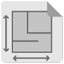

<ul class="related-links right">
Related:<li><a href="team.html">Team</a></li>
<li><a href="careers.html">Careers</a></li>
<!--<li><a href="FAQs.html">FAQs</a></li>-->
<li><a href="press.html">Press</a></li>
</ul>
<ul class="nav nav-tabs responsive hidden-xs hidden-sm" >
<li class="active">
<a href="#tabs-1" data-toggle="tab">G-Max</a>
</li>
<!--<li class="">
<a href="#tabs-2" data-toggle="tab">Fs Uno</a></li>-->
<!--<li class="">
<a href="#tabs-3" data-toggle="tab">Components / Tools</a></li>
<li class="">
<a href="#tabs-4" data-toggle="tab">Installation Manual</a>
</li>-->
<!--<li class=""><a href="#tabs-5" data-toggle="tab">Project checklists</a></li>-->
</ul>

<h2>Thank You for choosing G-Max</h2>

Schletter’s newest, innovative G-Max system, offers you ease-of assembly in the field and competitive pricing all in a steel mounting system.  We are confident that G-Max will change the way you install fixed–tilt mounting systems, saving you time and money. As you kickoff this project with Schletter, we thought these resources might be helpful to you and your team and ensure you have all the information necessary for a successful build!

 

 <table style="margin-left:20px" >
 <tr><td></td>
 <td>
<strong>Project Construction Drawings</strong> Detailed project construction drawings were included in your first shipment. <a href="teammap.html"> Please contact your sale representative or project integrator</a> for additional informations for your specific project drawings.
</td></tr>
<tr><td></td>
<td><strong><a href="https://www.schletter.us/support/MI-069%20G-Max%20Installation%20Manual%20V2.pdf" target="_blank">Installation Manual</a></strong> 

In addition to the specific drawings, we have included a step-by-step guide on how to install the G-Max System.
</td>
</tr>
<tr>
<td>
    </td> <td><strong>Delivery Schedule</strong>
 Your delivery schedule has been included in your first shipment so you will know when to expect deliveries from us.   <a href="/teammap.html" target="_blank">Please contact your sales representative or project integrator for additional information.</a> 
</td> 
</tr>
<tr><td></td><td><strong>Damaged or Missing Parts?</strong> 

 Use the <a href="\support\OI-901 Shipment Verification Instructions.pdf">
 Shipment Verification Instructions</a> to report any damaged or missing parts.
</td></tr>
 <tr><td> </td><td><strong>Contact Us</strong>. 
 <a href="/teammap.html" target="_blank">Please contact your sales representative or project integrator for additional information</a>
 </td></tr>
 <tr><td></td>
 <td>
<strong><a href="/blog.html" target="_blank">Schletter's Blog</a></strong>   Check out our blog for all the latest product information, Schletter news, customer success stories and more.  Be sure to subscribe to stay-up-to-date.
</td>
 </tr>
 </table>
 

   

 
 

    <a href="https://www.youtube.com/watch?v=ZrIq7Fku7PQ">G-Max Installation: Girder Assembly</a>
    <a href="https://www.youtube.com/watch?v=bv8yYhTML2I">G-Max Installation: Getting Started with Posts</a>    
    <a href="https://www.youtube.com/watch?v=TCi-OIUQDrI">G-Max Installation: Purlin Layout</a>
    <a href="https://www.youtube.com/watch?v=7mHBdBAJueE">G-Max Installation: Purlin Alignment.</a>
    <a href="https://www.youtube.com/watch?v=rS0vSBiJJNU">G-Max Installation: Modules and Schletter Clamp Options.</a>
   

<!--

 

-->

<!--

 

-->

<!--

-->

