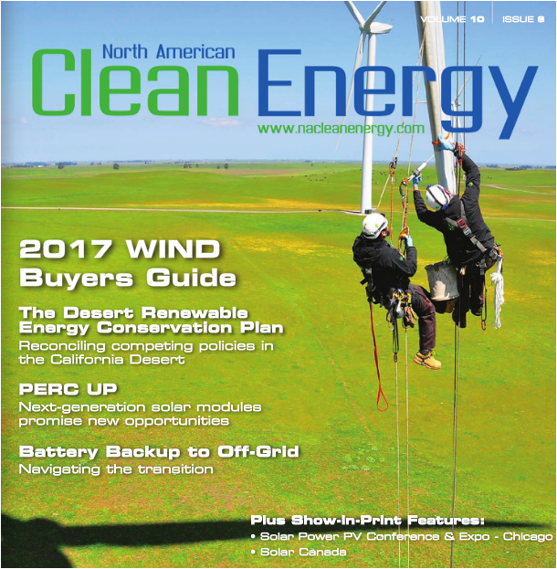

<section class="row">

<ul class="related-links">
Related:
<li><a href="about.html">About</a></li>
<li><a href="team.html">Team</a></li>
<!--<li><a href="FAQs.html">FAQs</a></li>-->
 <li><a href="events.html">Events</a></li>
</ul>

</section>

<h4>The latest news about Schletter Solar Mounting Systems.</h4>

<section class="row ">
    

<h3>Tweets</h3>

<a class="twitter-timeline"  href="https://twitter.com/SchletterInc"  data-widget-id="423104261090574338">Tweets by @SchletterInc</a>

 

<h3>Press Releases</h3>

<a href="pr-itctradecase.html">8/22/2017 — American Solar Manufacturers Urge Government Not to Crush Manufacturing Jobs with Tariffs</a>

<a href="pr-schlettergroup-newproducts-intersolar.html">4/04/2017 — New products at Intersolar</a>

<a href="pr-gmax.html">3/13/2017 — Announcing G-Max </a>

<a href="pr-evp.html">2/10/2017 — Expanded Management Team with New Executive VP of Product Technologies &amp; Applications</a>

 <a href="support/Press-documents/PR-Schletter-Alliance.pdf">05/27/2016 — Schletter Alliance</a>

 <a href="pr-cco.html">05/23/2016 — Expanded Management Team with New CCO</a>

 
 <a href="support/Press-documents/PR-Brice.pdf">6/18/14 — New President &amp; CEO</a>

 <a href="support/Press-documents/AluGrid 040814.pdf">4/18/14 — AluGrid Enhancements</a>

 <a href="support/Press-documents/Fix-EZ ETL 031314.pdf">3/13/14 — Fix-EZ: Now ETL Listed</a>

 <a href="support/Press-documents/Kelly-VPSales-0114.pdf">01/01/14 — New VP of Sales</a>

<a href="support/Press-documents/Gehrlicher-GM-0114.pdf">01/01/14 — Schletter Canada GM</a>

 <a href="support/Press-documents/NCGO_111913.pdf">11/19/13 — NC Grand Opening</a>

 <a href="support/Press-documents/Schletter and Shoals 091613.pdf">10/14/13 — Schletter &amp; Shoals</a>

   
 <a href="http://www.solarpowerworld-digital.com/solarpowerworld/may_2013#pg23" target="_blank">05/01/13 — Park@Sol in SPW</a>

   
 <a href="support/Press-documents/Tucson-Open House-03-14-2013.pdf">03/14/13 — Tucson Open House </a>

  <h3>News</h3>
  
  <a href="https://www.altenergymag.com/article/2018/02/the-cummins-carport-project-%E2%80%94-a-parksol-success-story/27988">
Park@Sol installed by Solfuturo for Cummins. Check it out on altenergymag.com.
</a>
  
  
Schletter's <a href="http://www.nacleanenergy.com/magazine/marapr_2017/#p=32">G-Max Fixed Tilt Ground Mount System</a> and <a href="http://www.nacleanenergy.com/magazine/marapr_2017/#p=44">Park@Sol Carport System</a> as seen in North American Clean Energy March/ April 2017 issue

  
  

  <a href="http://www.solarpowerworldonline.com/2016/11/big-three-avoid-utility-scale-ground-mounting-challenges/?spMailingID=9883872&amp;spUserID=MTU0MTAzNDU0MTI4S0&amp;spJobID=1041273470&amp;spReportId=MTA0MTI3MzQ3MAS2">
  Solar Power World’s featured article titled <i style="font-style:italic">The Big Three: How to avoid these utility-scale ground-mounting challenges</i> in the November 2016 issue</a>

  
  
<a href="http://www.nacleanenergy.com/magazine/novdec_2016/#p=30">Schletter’s Rapid5K Grounding Module Clamp as seen in <i style="font-style:italic">North American Clean Energy</i> November / December 2016 Issue</a>

</section>