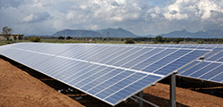
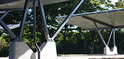
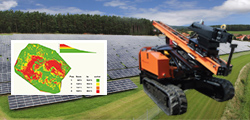
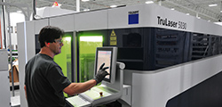
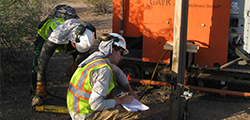

<h4>Schletter is a global solar mounting system manufacturer and metal fabricator with a manufacturing facility  in Shelby, NC and sales and training locations in Tucson, Arizona and Windsor,Ontario.</h4> 
<section class="row">

<a href="ground-mount.html">Ground Mount
</a>
Highly pre-assembled aluminum and steel mounting systems.

<a href="roof-mount.html">Roof Mount
</a>
Easy-to-intall systems and components for nearly any roof type.

<a href="carport.html">Carport
</a>
Custom engineered for residential applications to large commercial lots.

</section>

<section class="row">

<a href="solar-tools.html">Solar Tools
</a> 
A variety of PV tools, including solar design software and the GAYK Ram.

<a href="metal-fabrication.html">Metal Fabrication
</a> 
Custom solutions including CNC Bending, laser cutting, punching and welding.

<a href="services.html">Services 
</a> 
We offer engineering support, geotechnical soil testing, and installation services.
 

</section>