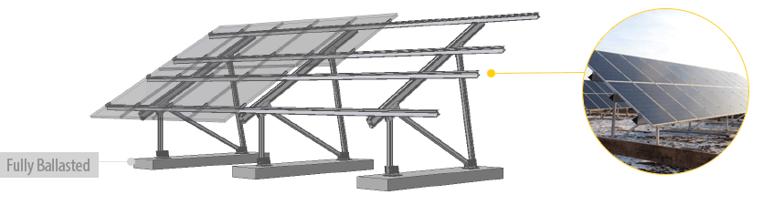
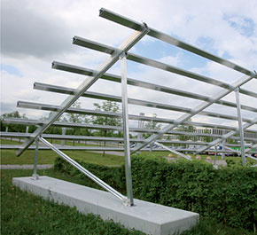
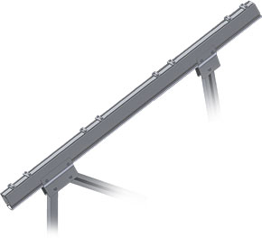
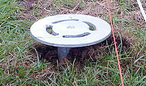

<h4>Easily install residential to commercial-scale arrays on difficult terrain, with the PvMax ballasted solution.</h4>
 

 <h4 class="section">Make the Most of Your Soft or Rocky Land</h4>
 <section class="row">

 
Driven post systems are undoubtedly an excellent solution for many ground mounted PV installations.
      But what do you do in cases where the soil is too soft or too rocky to drive posts into? For those small- to 
      medium-scale systems that meet this criteria, <strong>use the fully ballasted PvMax system</strong>. Ideal for maximizing the number of panels on tricky terrain,
       PvMax can go anywhere!

<h4 class="">System Benefits</h4>
<ul>
<li>Cast in place concrete ballasts</li>
<li>Ideal for soft or rocky soil such as on landfill sites or residential locations</li>
<li>Partially pre-assembled support structure facilitates quick installation</li>
<li>No heavy machinery necessary</li>
<li>Long rail spans reduces the number of necessary supports and foundations</li>
</ul>

</section>

<h4 class="section">Quick Installation</h4>
<section class="row">

     

<iframe width="500" height="350" class="img-responsive" src="https://www.youtube.com/embed/GJ968sFYKAk?rel=0" frameborder="0" allowfullscreen=""></iframe>

</section>

<h4 class="section">Optimized Aluminum Connections and Components</h4>
<section class="row">

From the ground up to the module attachments, the PvMax systems efficiently uses all components so that you can mount more modules.
Strong structural geometry allows for anywhere from 2 to 4 rows of modules in vertical orientation or from 3 to 6 rows of modules in horizontal orientation. 
The implementation of Schletter’s unique S-Rail means longer spans between foundations, helping to reduce the number of necessary ballasts and thus reduce overall system cost.

</section>
<h4 class="section">Aren’t There Any Alternative to the Concrete Ballasts?</h4>
<section class="row">

   

You’re in luck! In some special circumstances, ground screws may be used in place of the concrete foundations.
The system structure doesn’t change at all, simply install the ground screws and then bolt the PvMax feet to the screws much like you would attach them to concrete;
 the rest stays the same. On your next ballasted ground mount project, your Schletter Technical Sales representative will help you figure out if ground screws are right for your project. 

 

 

 
 

</section>

<section  class="">
<!---->

 
<h4>What to expect from Schletter</h4>
<ul>
<li>Full in-house engineering services</li>
<li>20 year limited warranty on aluminum systems</li>
<li>100% IBC 2006, 2009, 2012 code compliant systems, with PE wet stamps available in most states
</li>
</ul>

 
<h4>Additional Resources</h4>
<ul>
<li><a class="pdf-icon" href="support/PvMax-Product-Sheet.pdf" target="_blank">PvMax Product Sheet »</a></li>
<li><a class="pdf-icon" href="support/PvMax-Install-Manual.pdf" target="_blank">PvMax Install Manual »</a></li>
<li><a class="pdf-icon" href="support/Ground-Mount-System-Overview.pdf" target="_blank">Ground Mount System Overview »</a></li>
</ul>

</section>
