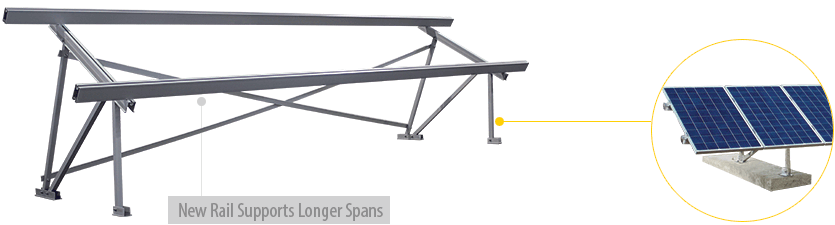
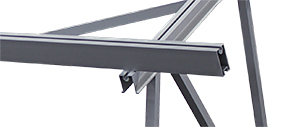
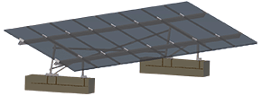
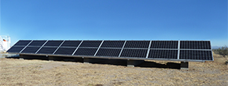

---
layout: page
title: PvMini
description: Combining elements from two of Schletter’s most popular systems, PvMini is a ballasted ground mount system which
 offers a cost-effective alternative design to the solid PvMax.
--- 

<h4 >Maximize System Efficiency</h4>
 

<section class="row">
    

 
Combining elements from two of Schletter’s most popular systems, PvMini is a ballasted ground mount system which
 offers a cost-effective alternative design to the solid PvMax. The addition of the <strong> new ProfiPlus XT module-bearing
rail </strong>allows for increased spans between foundations helping every other component in the system to be utilized to its fullest potential.

 Reaching new levels of system efficiency with an extremely lightweight and low-profile design results in fewer and smaller concrete foundations 
    for the least invasive ballasted ground mount solution available.

    

    

  
New ProfiPlus XT Rail for longer spans

       

 </section>

<h4 class="section">System Benefits</h4>

<section class="row">

<ul class="col-md-8">
     <li>Concrete ballast ground mount system</li>
     <li>Ideal for landfill sites or areas with rocky terrain</li>
     <li>Most cost-effective solution for single-row-vertical,
     or two-row-horizontal installations</li>
     <li>Maximized system efficiency with the proprietary
     ProfiPlus XT™ Rails</li>
     <li>Fast installation with partially pre-assembled
     support kits and no heavy machinery required</li>
</ul>

 

</section>

 <h4 class="section">Applications</h4>

<section class="row">

<ul>
    <li>PV installations of any scale</li>
    <li>When pile driven posts and larger concrete foundations are not possible</li>
    <li>One-portrait or two-landscape module configurations</li>
    <li>Increased ground clearance</li>
    <li>Rocky terrain</li>
    <li>Landfill sites</li>
 </ul>
 

 

 
 

</section>

<section class=""> <!---->

    <h4>What to expect from Schletter</h4>
<ul>
<li>Full in-house engineering services </li>
<li>20 year limited warranty on aluminum systems</li>
<li>100% IBC 2006, 2009, 2012 code compliant systems, with
PE wet stamps available in most states</li>
</ul>

 <h4>Additional Resources</h4>
 <ul>
            <li><a class="pdf-icon" href="support/PvMini-Product-Sheet.pdf" target="_blank">PvMini Product Sheet »</a></li>
            <li><a class="pdf-icon" href="support/PvMini-Install-Manual.pdf" target="_blank">PvMini Install Manual »</a></li>
            <li><a class="pdf-icon" href="support/Ground-Mount-System-Overview.pdf" target="_blank">Ground Mount System Overview »</a></li>
          </ul>
          

</section>
