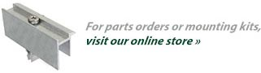

<h4>Receive a mounting system quote. Select an option:</h4>
<section class="row">

 
<a class="action-button action-button-ground btn btn-primary " style="color:#fff" href="ground-mount-quote.php">Ground Mount »</a> OR
<a class="action-button action-button-roof btn btn-primary" style="color:#fff" href="roof-mount-quote.php">Roof Mount »</a> 

  

</section>

<h4 class="section">Not sure of your project details? Fill out the form below or call (888) 608 - 0234 </h4>

<section class="row">

<!--  <iframe height="810" allowTransparency="true" frameborder="0" scrolling="no" style="width:100%;"  src="http://schletter.wufoo.com/embed/z7x4a3/?wmode=transparent">
</iframe>-->

<form action="https://webto.salesforce.com/servlet/servlet.WebToLead?encoding=UTF-8" method="POST" role="form" class="form-controls">

<input type="hidden" name='captcha_settings' value='{"keyname":"SFWebtoLeadCaptcha","fallback":"true","orgId":"00D15000000N648","ts":""}'>
<input type="hidden" name="oid" value="00D15000000N648">
<input type="hidden" name="retURL" value="https://www.schletter.us/thank-you.html">
<input type="hidden" name="debug" value='0'>
<input type="hidden" name="debugEmail" value="kateka.thach@schletter-group.com">

<!--  ----------------------------------------------------------------------  -->
<!--  NOTE: These fields are optional debugging elements. Please uncomment    -->
<!--  these lines if you wish to test in debug mode.                          -->
<!--  <input type="hidden" name="debug" value=1>                              -->
<!--  <input type="hidden" name="debugEmail"                                  -->
<!--  value="alison.snodgrass@schletter.us">                                  -->
<!--  ----------------------------------------------------------------------  -->

<ul>
<li>
<label for="first_name" class="desc">First Name</label>

<input id="first_name" maxlength="40" name="first_name" size="20" type="text" required="true">

</li>

<li>
<label for="last_name " class="desc">Last Name</label>

 <input id="last_name" maxlength="80" name="last_name" size="20" type="text" required="true">

</li>

<li>
<label for="company" class="desc">Company</label>

<input id="company" maxlength="40" name="company" size="20" type="text" required="true"> 

</li>

<li>
<label for="title" class="desc">Title</label>

<input id="title" maxlength="40" name="title" size="20" type="text" required="true"> 

</li>

<li>
<label for="street" class="desc">Street</label>

<textarea name="street" required="true"></textarea>

</li>

<li>
<label for="city" class="desc">City</label>

<input id="city" maxlength="40" name="city" size="20" type="text" required="true">

</li>

<li>
<label for="state" class="desc">State/Province</label>

<input id="state" maxlength="20" name="state" size="20" type="text" required="true">

</li>

<li>
<label for="zip" class="desc">Zip</label>

<input id="zip" maxlength="20" name="zip" size="20" type="text" required="true">

</li>

<li>
<label for="country" class="desc">Country</label>

<input id="country" maxlength="40" name="country" size="20" type="text" required="true">

</li>

<li>  <label for="email" class="desc">Email</label>

<input id="email" maxlength="80" name="email" size="20" type="text" required="true">

</li>

<li>  <label for="phone" class="desc">Phone</label>

  <input id="phone" maxlength="40" name="phone" size="20" type="text" required="true">

</li>

<li>  <label for="mobile" class="desc">Mobile</label>

<input id="mobile" maxlength="40" name="mobile" size="20" type="text"> 

</li>

<li>  <label for="URL" class="desc">Website</label>

  <input id="URL" maxlength="80" name="URL" size="20" type="text" required="true"> 

</li>

<li>
<label class="desc">  Market Type:</label>

<select id="00N1500000GCaKv" multiple="multiple" name="00N1500000GCaKv" title="Market Type" required="true"><option value="Residential">Residential</option>
<option value="Commercial">Commercial</option>
<option value="Industrial">Industrial</option>
<option value="Utility">Utility</option>
</select> 

</li>

<li>
<label class="desc">  Market Role:</label>

<select id="00N1500000GCaL0" multiple="multiple" name="00N1500000GCaL0" title="Market Role" required="true"><option value="Contractor">Contractor</option>
<option value="Manufacturer">Manufacturer</option>
<option value="EPC">EPC</option>
<option value="Developer">Developer</option>
</select> 

</li>
<li>
<label class="desc">  Project Type: </label>

 <select id="00N1500000GCaKb" multiple="multiple" name="00N1500000GCaKb" title="Project Type" required="true"><option value="Ground Mount">Ground Mount</option>
<option value="Roof Mount">Roof Mount</option>
<option value="Carport">Carport</option>
<option value="Metal fabrication">Metal fabrication</option>
</select> 

</li>
<li>
<label class="desc">  Project Size (kw): </label>

<input id="00N1500000GCaKH" name="00N1500000GCaKH" size="20" type="text" required="true"> 

</li>

<li>  <label for="description" class="desc">Questions or Comments</label>
<textarea name="description" required="true"></textarea> 
</li>
<li>

<input type="hidden" name="lead_source" id="lead_source" value="Website">

</li>

<li>

</li>

<li>

<input type="submit" name="submit">

</li></ul>
</form>

</section>