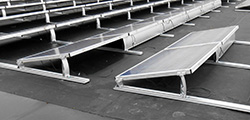

<h3>Fast and easy ballasted options.</h3>

              <a href="fix-ez.html">Fix-EZ™ 
          </a> 
           Easiest Roof Solution
        

        
  
             <a href="fixgrid.html">FixGrid™ 
                                    </a> 
                                    Compact Design
        

         <a href="windsafe.html">Windsafe™ 
                                    </a> 
                                    Quick Installation

<h3> Penetrating solar mounting systems.</h3>

       

             <a href="flush-mount.html">Standard Flush Mount 
             </a> 
             For All Roof Types, Design and Order Online
             

    

           <a href="fixz.html">FixZ Series™ 
           </a> 
           Added Pitch
       
  

