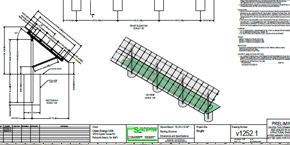
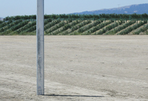
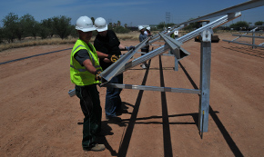

<h3>Schletter provides complete PV project solutions, working as a partner with customers to achieve success.</h3>
<h4>Engineering Support</h4>
<section class="row">

<ul class="">
<li >In-house end-to-end engineering for every solar project</li>
<li>PE stamped drawings and structural calculations available in most states</li>
<li>Design solutions for nearly any project - even when others say it can't be done</li>
<li>Expert guidance throughout the entire project</li>
<li>Project <a href="solar-tools.html">design tools</a> available for developers and installers</li>
</ul>

</section>
   
<h3 class="section">Geotechnical Testing</h3>

<section class="row">

Whenever a ground mount post is driven into the ground, soil testing is required to minimize the embedment depth.
Some of the largest solar systems in the world are FS Systems™ and soil testing ensures system stability and longevity.
Schletter always conducts a detailed geotechnical investigation prior to the installation of a ground mounted photovoltaic system. 

 
<ul>
<li>Soil samples are removed from the project site</li>
<li>Laboratory analysis and tests are performed</li>
<li>A detailed report—stamped by a Schletter engineer—is provided to the customer</li>
</ul>

    
<a href="fs-system.html">Learn more about the FS System »</a>

  	

</section>
 
<h3 class="section">Training and Support</h3>
<section class="row">
    

Schletter offers a variety of complimentary and paid training opportunities throughout the year including webinars, workshops, lunch-and-learns, tradeshows, and roadshows.
                            
<ul>
<li>Network with solar industry professionals</li>
<li>Earn NABCEP continuing education credits</li>
<li>View live installation demos</li>
<li>Learn the latest in solar products, system design, time-saving installation steps, financing, and project development </li>
</ul>

    
<a href="events.html">Learn about upcoming events »</a>

</section>

