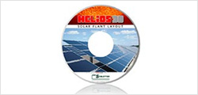
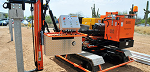
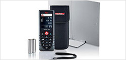

<h4>Design &amp; planning tools for solar mounting systems.</h4>
<section class="row">

<a target="_blank" href="http://www.pvpowerhouse.com">PV Powerhouse App™
</a> 
 A free web app to easily design and purchase a flush mount system online.

 

      <a target="_blank" href="http://www.pvgroundbreaker.com">PV Groundbreaker App™
      </a> 
      Estimate potential power output for ground mount systems.

</section>
<h4>Distributed products designed to simplify solar projects.</h4>
<section class="row">
 
 

     <a href="helios-3d.html">Helios 3D™
     </a> 
     Advanced PV layout software for utility-scale solar mounting systems.

     <a href="gayk.html">GAYK Pile Driver™
     </a> 
     Rapidly rams posts for the fastest installation.

     <a href="measuring-tools.html">Leica Measuring™
     </a> 
     Portable outdoor distance meters with a variety of features.

</section>