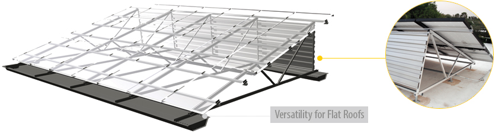
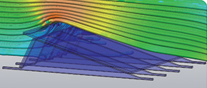
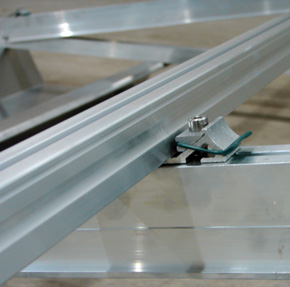

 
<h4>Load optimized and ready for any installation size on flat roofs.</h4>

<h3 class="clear section"></h3>

<h4>Install Quickly, Deflect Wind, Reduce Loads</h4>
<section class="row">

Delivered highly pre-assembled, the Windsafe system installs quickly and easily. Sturdy triangular supports simply fold out and tighten down and come complete with Schletter’s patented KlickTop cross rail connectors installed in the ideal locations for your project’s module size. Each row of racking is outfitted with wind deflectors, effectively redirecting airflow and reducing the load on rooftops.

 <h4>System Benefits</h4>
<ul>
 <li>Highly customizable system configuration to fit any project specifications</li>
<li>Optimized load based on wind dynamics testing and hands-on experience</li>
<li>Delivered up to 70% pre-assembled</li>
<li>IBC code compliant and reliable in any wind speed or snow load</li>
</ul>
 

 
       
 

Designed based on wind tunnel testing

 </section>
 <h3 class="section">Installation Video</h3>    
<section class="row">              

<iframe width="489" height="287"  class="img-responsive" src="http://www.youtube.com/embed/3QpGpo70mwk?rel=0" frameborder="0" allowfullscreen=""></iframe>

  

KlickTop connectors for rapid installation

</section>

<h4 class="section">Penetrating or Ballasted</h4>
<section class="row">                

The Windsafe system is highly customizable, attaching to flat roofs either directly via a selection of penetrating attachments or using ballast trays. Available with a choice of fixed tilt from 10 to 45 degrees, power output of the array can be optimized. Using the tilt angle options in combination with various module row configurations can also maximize panel concentration on the roof.

Versatile flat roof solution
 
 

</section>

 

 
<section class="">
 

 <!-- -->
 <h4>What to expect from Schletter</h4>
 <ul>
 <li>Full in-house engineering services </li>
 <li>20 year limited warranty on aluminum systems</li>
 <li>100% IBC 2006, 2009, 2012 code compliant systems, with
  PE wet stamps available in most states</li>
 </ul>

<h4>Additional Resources</h4>
<ul>
<li><a class="pdf-icon fa fa-file-pdf-o" href="support/Windsafe-Product-Sheet.pdf" target="_blank">Windsafe Product Sheet »</a></li>
<li><a class="pdf-icon fa fa-file-pdf-o" href="support/Windsafe-Installation-Manual.pdf" target="_blank">Windsafe Installation Guide »</a></li>
<!--<li><a class="pdf-icon fa fa-file-pdf-o" href="support/Roof-Mount-System-Overview.pdf" target="_blank">Roof Mount Overview »</a></li>-->
</ul>

</section>                      
                        